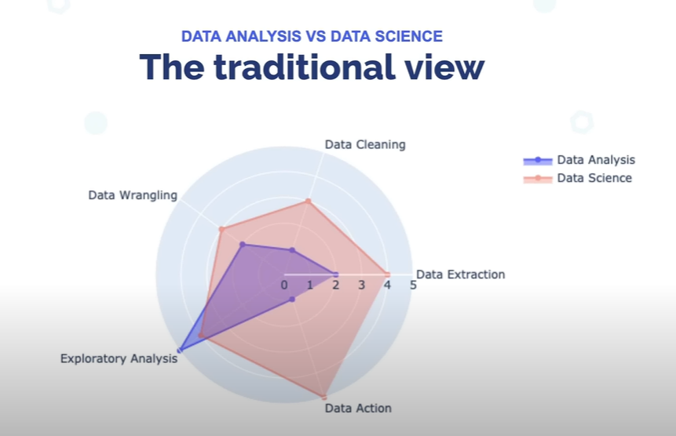

# Data-Analytics
#### About the Repo
This repository will include notebooks showcasing my journey in Data Analytics and visualization using Python

#### Data Anlysis: 
- The process of collecting, inspecting, cleaning, transforming, modeling (finding pattern) with the goal of discovering useful information so that we can make out conclusion and support decision-making.
- The process of Data Analysis comprises mainly of 5 Steps :
  - Data Extraction : This is basically the data collection phase. It can be in any form. SQL, CSV, JSON, XML. This will also include scrapping.
  - Data Cleaaning :  Dealing with the null valuse, missing values, empty data, incorrect values, outliers etc. If you have scrapped the data, then this step becomes a crucial one. 
  - Data Wrangling : After the cleaning, comes the step of reshaping, formatting, merging combining, basically **making the data ready for analysis and pattern finding**. 
  - Analysis : This includes visualizing data, testing hypothesis, doing statistical analysis on the data, Correlation VS Causation Analysis. EDA Basically.
  - Model Building : Finally, after getting the hang of the data, we finally test out our ways and build models upon aur findings. This model will help us in making future decision. 
  